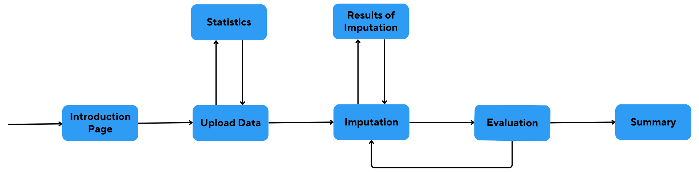

# Visualization App

This application is designed to visualize the results of five different imputation methods: Mean, kNN, MissForest, GAIN, and MICE. You can observe the effects of the selected methods on three machine learning models: Decision Tree, SVM, and kNN.

## Installation
The application is created and tested using python version 3.10.2.
To install the application, follow these steps:

1. Create a virtual environment: `python -m venv .venv`
2. Activate virtual environment:
   * using Windows Powershell: `.venv\Scripts\Activate.ps1`
   * using Windows Command Prompt: `.venv\Scripts\activate.bat`
   * using macOS/Linux: `source .venv/bin/activate` 
3. Install requirements: `pip install -r requirements.txt`

## Usage
Start the application by running `python -m src.app` and open [http://127.0.0.1:8050/](http://127.0.0.1:8050/) (it may take a while). 
It is recommended to use Google Chrome/Microsoft Edge/Mozilla Firefox. To navigate through the pages of the application, please follow the diagram:

If you want to test the application run: `pytest tests/`.

## Change of preset values
To modify the maximum number of categories allowed in the target for a classification problem, change the `MAX_CLASS` parameter in the `src/pages/page_data.py` file.

Similarly, to change the maximum number of unique values in numerical feature to be cast to categorical, adjust the `MAX_CATEGORY` parameter in the `src/data_loading/data_handler.py` file.

## Implementation of new imputation methods
To implement a new method of imputation, use `src/imputation/template_imputer.py`. The created class must have the 
following methods implemented to work properly:

- `provide_info()`
- `param_tuning()`
- `impute_data(data, int64_cols, target)`
- `params_callback()`

They are all described more in the template. Also, set `self.name` so the correct name of the method will be displayed.

Once the class is implemented, navigate to `src/pages/page_impute.py`. Import the class, and in the `__init__()` function, add values to `self.options` and `self.methods` as explained in the code.

## Implementation of new ML models
To implement a new ML model, use `src/ml_training/class_template.py` for classification or `src/ml_training/regr_template.py` for regression. You will need to specify the following according to the comments in `src/ml_training/model_template.py`:

- `self.model`
- `self.model_imp`
- `self.metric`
- `self.metric_name`
- `self.fill_orig`
- `self.normalise`

Training of models and providing the output is already implemented and is suitable in most cases. If you wish to customize it implement  `train_model(train_page)`. Details of this function can be also found in `scr/ml_training/model_template.py`.

Once the class is implemented, navigate to `src/pages/page_train.py`. Import the class, and in the `__init__()` function, add values to `self.classification` or `self.regression` depending on the type of ML problem, and update `self.algo_impl` as explained in the code.
